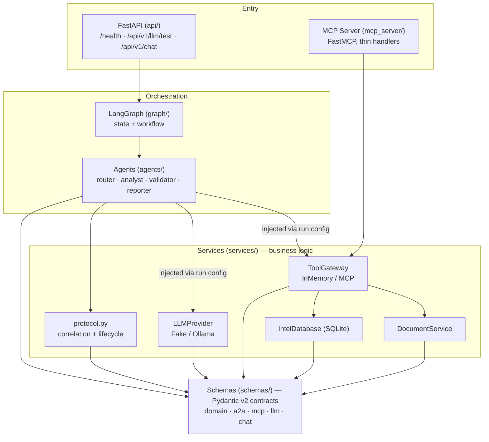

# MilTech Demo — Local-First Multi-Agent Intelligence Platform

A production-style prototype that turns an intelligence question into a structured,
**evidence-backed report** using a small graph of cooperating agents. It
demonstrates a clean integration of **FastAPI + LangGraph + MCP (Model Context
Protocol) + an A2A-style agent protocol + a local LLM (Ollama)** — built for
*architecture quality, type safety, testability, and explainability* rather than
feature count.

> **Honesty notes**
> - This implements an **A2A-*style*** protocol inspired by agent-to-agent
>   concepts. It is **not** official Google A2A compliance — no A2A SDK, no
>   JSON-RPC transport, no spec agent-card discovery.
> - The default LLM provider is a **local Ollama model**. A deterministic **fake**
>   provider (`MILTECH_LLM_PROVIDER=fake`) is opt-in for fully offline runs; the test
>   suite always uses it, so tests stay reproducible without a model server.
> - Retrieval is real (MCP tools over synthetic data); the narrative *wording* is
>   model-generated. The data is synthetic and illustrative.

---

## 1. Project overview

Given a query such as *"Summarize recent activity in the eastern corridor,"* the
platform runs a deterministic, observable pipeline:

```
router → analyst → (MCP tools) → validator → reporter → IntelligenceReport
```

Every step is an explicit, typed **A2A protocol object** carrying a single
`trace_id`, so an entire run is traceable and debuggable. Agents retrieve real
evidence through **MCP tools** (document search + a synthetic SQLite intel DB),
and the analyst/reporter synthesize text through a **pluggable LLM provider**.

The result is returned over HTTP:

```jsonc
// POST /api/v1/chat  ->
{ "answer": "...", "evidence": [ /* cited snippets */ ], "agent_trace": [ /* steps */ ] }
```

**Stack:** Python 3.12 · uv · FastAPI · Pydantic v2 · LangGraph · MCP Python SDK ·
Ollama · httpx · structlog · pytest · ruff · mypy (strict).

---

## 2. Architecture

Strict layering with a one-way dependency direction; business logic never lives in
endpoints, Pydantic models, or MCP handlers.



- **`schemas/`** — typed contracts only (no logic).
- **`services/`** — all behavior: A2A correlation/lifecycle, document & intel
  services, the `ToolGateway`, and the `LLMProvider`.
- **`agents/` + `graph/`** — LangGraph nodes and wiring.
- **`mcp_server/`** — real MCP server; handlers delegate to the gateway.
- **`api/`** — thin FastAPI endpoints that delegate to the workflow.
- **`core/`** — `pydantic-settings` config + structlog setup.

Dependencies (`ToolGateway`, `LLMProvider`) are **interfaces** chosen by config and
**injected** into agents via the LangGraph run config — agents never import a
concrete tool/model client (enforced by a guard test).

---

## 3. Why LangGraph

The task is a small, explicit, multi-step pipeline with shared evolving state — a
natural fit for a state graph rather than ad-hoc function calls or a heavyweight
agent framework.

- **Explicit control flow.** `router → analyst → validator → reporter` is declared
  as a graph; easy to read, reason about, and explain in an interview.
- **Typed, reducer-based state.** `GraphState` is a `TypedDict` with `operator.add`
  reducers, so each node returns only the items it produced and they accumulate
  deterministically.
- **Single-responsibility nodes.** Each node is a small typed function with one job.
- **Dependency injection.** LangGraph's run `config` carries the `ToolGateway` and
  `LLMProvider`, keeping nodes pure w.r.t. their dependencies.

We deliberately avoid autonomous looping/branching here — the value is a clear,
auditable workflow, not emergent behavior.

---

## 4. Why MCP

The Model Context Protocol gives tools a **standard, typed, discoverable** surface
that any MCP client (e.g. Claude Desktop) can call — not a bespoke function API.

- A real `FastMCP` server (`mcp_server/server.py`) exposes three tools:
  `search_documents`, `get_document`, `query_intel_db`.
- Handlers are **thin**: validate typed input → delegate to the `ToolGateway` →
  return a typed Pydantic result (MCP structured output is generated from the
  contracts).
- The **same tool logic** is reused in-process by the agents and over the protocol
  by external clients — one implementation, two transports.

This demonstrates MCP as a genuine interoperability boundary, not a wrapper.

---

## 5. Why an A2A-style protocol

Multi-agent systems are hard to debug when agents pass loose dicts. This project
models **every** agent interaction as an explicit, validated object:

- `AgentTask`, `AgentMessage`, `AgentArtifact`, `AgentResponse` (`schemas/a2a.py`).
- One `trace_id` is minted by the router and **propagated** to every child task,
  message, artifact, and response.
- Correlation is **enforced**: `attach_message` / `attach_artifact`
  (`services/protocol.py`) validate matching `task_id` + `trace_id` and raise
  `ProtocolViolationError` on mismatch — broken correlation fails loudly.
- A declarative status lifecycle (`PENDING → RUNNING → COMPLETED/FAILED/CANCELLED`)
  is enforced by `advance_task_status` / `can_transition`.

> Again: this is **A2A-style**, inspired by agent-to-agent concepts — **not**
> official Google A2A compliance.

---

## 6. Workflow walkthrough

```mermaid
sequenceDiagram
    autonumber
    actor User
    participant API as FastAPI /api/v1/chat
    participant R as router
    participant A as analyst
    participant TG as ToolGateway (MCP tools)
    participant V as validator
    participant Rep as reporter

    User->>API: { "query": "..." }
    API->>R: run_workflow(query, gateway, llm)
    R->>R: create root AgentTask (mint trace_id)
    R->>A: route (target_agent=analyst)
    A->>TG: search_documents / query_intel_db
    TG-->>A: hits + intel rows
    A->>A: build Evidence; LLM synthesizes analysis
    A->>V: AgentMessage + AgentArtifact + AgentResponse
    V->>TG: query_intel_db (corroboration)
    V->>Rep: AgentMessage + AgentArtifact + AgentResponse
    Rep->>Rep: LLM summary + IntelligenceReport(evidence)
    Rep-->>API: final_report + agent_trace
    API-->>User: { answer, evidence, agent_trace }
```

**Agent responsibilities**

| Agent | Reads | Produces |
|-------|-------|----------|
| **router** | the user query | root `AgentTask` (owns `trace_id`) + routing `AgentMessage` |
| **analyst** | root task | MCP retrieval → `Evidence`; LLM analysis; `AgentMessage`/`AgentArtifact`/`AgentResponse`; next task → validator |
| **validator** | analyst artifact | tool corroboration; `AgentMessage`/`AgentArtifact`/`AgentResponse`; next task → reporter |
| **reporter** | validated artifact + evidence | LLM summary → `IntelligenceReport`; report `AgentArtifact`/`AgentResponse` |

The single `trace_id` ties every object in the run together (see
[`docs/architecture.md`](docs/architecture.md)).

---

## 7. Repository structure

```
src/miltech_demo/
├── api/            # FastAPI app (health, llm/test, chat) — thin
├── agents/         # LangGraph nodes: router, analyst, validator, reporter (+ _deps)
├── graph/          # GraphState (TypedDict + reducers) + workflow wiring
├── mcp_server/     # FastMCP server exposing the three tools
├── services/       # business logic: protocol, documents, intel_db,
│                   #   tool_gateway (+ mcp_gateway), llm (+ ollama_provider)
├── schemas/        # Pydantic v2 contracts: a2a, documents, evidence, report,
│                   #   mcp, llm, chat, enums, base
├── core/           # config (pydantic-settings) + structlog logging
└── data/reports/   # synthetic markdown intelligence reports
tests/              # unit + integration tests mirroring the package layout
docs/               # architecture.md, mcp.md, llm.md
```

---

## 8. Running locally with uv

Requires Python 3.12 and [uv](https://docs.astral.sh/uv/).

```bash
make install          # uv sync (creates .venv, installs deps + dev tools)
make run              # FastAPI on http://localhost:8000  (docs at /docs)
make mcp-server       # run the MCP server over stdio for an MCP client
```

Quality gates:

```bash
make lint             # ruff
make type             # mypy --strict
make test             # pytest
make check            # lint + type + test
```

Configuration is environment-driven (prefix `MILTECH_`, see `.env.example`):

| Variable | Default | Purpose |
|----------|---------|---------|
| `MILTECH_LLM_PROVIDER` | `ollama` | `ollama` (local model) or `fake` (deterministic, offline) |
| `MILTECH_TOOL_GATEWAY` | `memory` | `memory` (in-process) or `mcp` (real MCP client) |
| `MILTECH_MODEL_NAME` | `qwen2.5:7b-instruct` | Ollama model |
| `MILTECH_OLLAMA_BASE_URL` | `http://localhost:11434` | Ollama endpoint |
| `MILTECH_INTEL_DB_PATH` | `intel.db` | synthetic SQLite DB path |
| `MILTECH_LOG_LEVEL` | `INFO` | structlog level |

The default provider is `ollama`, so `make run` expects a reachable Ollama server
with the model pulled:

```bash
ollama serve && ollama pull qwen2.5:7b-instruct   # or: make pull-model (Docker)
make run
```

To run fully offline with no model server, opt into the deterministic fake provider:

```bash
export MILTECH_LLM_PROVIDER=fake
make run
```

---

## 9. Running with Docker

```bash
make docker-build                     # docker build -t miltech-demo .
make docker-run                       # runs the API on :8000 (uses .env)
```

Or bring up the API **and** an Ollama service together:

```bash
docker compose up --build             # app (:8000) + ollama (:11434)
```

The image runs as a non-root user and includes a `HEALTHCHECK` hitting `/health`.
`docker-compose.yml` wires `MILTECH_OLLAMA_BASE_URL=http://ollama:11434`, then a
one-shot `ollama-init` service **pulls the model** (`MILTECH_MODEL_NAME`, sourced
from `.env`) once Ollama is healthy; the app waits for that pull to complete before
starting, so it never comes up against an empty model store. To (re)pull into a
running stack: `make pull-model` (optionally `MODEL=...`).

---

## 10. Example API requests

**Health**

```bash
curl -s localhost:8000/health | jq
# { "status": "ok", "environment": "local", "model": "qwen2.5:7b-instruct" }
```

**End-to-end chat** (the full multi-agent workflow)

```bash
curl -s localhost:8000/api/v1/chat \
  -H 'content-type: application/json' \
  -d '{"query": "Summarize recent activity in the eastern corridor."}' | jq
```

```jsonc
{
  "answer": "Validated findings for ...",
  "evidence": [
    {
      "document_id": "eastern-corridor",
      "snippet": "Increased vehicle movement observed along the eastern corridor...",
      "relevance_score": 1.0,
      "rationale": "Document matched query '...'."
    }
  ],
  "agent_trace": [
    "router: created root task -> analyst",
    "analyst: retrieved evidence via tools -> validator",
    "validator: validated + corroborated analysis -> reporter",
    "reporter: compiled final report"
  ]
}
```

**LLM connectivity probe**

```bash
curl -s localhost:8000/api/v1/llm/test \
  -H 'content-type: application/json' \
  -d '{"prompt": "Say hello in one word."}' | jq
# { "text": "...", "model": "qwen2.5:7b-instruct" }   (or "fake-llm" with the fake provider)
```

Interactive OpenAPI docs are at `http://localhost:8000/docs`.

---

## 11. Testing

```bash
make test
```

The suite (~100 tests; `pytest`) covers, mirroring the package layout:

- **Schemas** — validation, serialization round-trips, JSON-schema examples.
- **Services** — `protocol` correlation/lifecycle; `documents`/`intel_db`
  (including a *no-arbitrary-SQL* guarantee); `tool_gateway` **conformance** over
  both `InMemory` and `MCP` (in-memory transport) implementations; `llm` (fake
  determinism + Ollama via a stub client; a real-server test is opt-in/skipped).
- **MCP server** — tools registered + structured output via `FastMCP.call_tool`.
- **Graph** — full workflow execution; trace/artifact/response/evidence propagation.
- **API** — `/api/v1/chat` and `/api/v1/llm/test` integration (deps overridden with
  a temp-DB gateway + fake LLM).
- **Guard** — agents never import concrete tools/model clients.

The test suite pins the fake LLM + in-memory gateway, so tests are deterministic,
offline, and reproducible without a model server — regardless of the app's
configured provider.

---

## 12. Future improvements

Honest backlog (some surfaced by an internal code review):

- **Lifecycle for `MCPToolGateway`** — the cached gateway (when
  `MILTECH_TOOL_GATEWAY=mcp`) isn't closed on shutdown; add a FastAPI lifespan hook.
- **Cache the compiled LangGraph** instead of recompiling per request.
- **Real retrieval/RAG** — embeddings + a vector store behind `search_documents`;
  promote `agents/retriever.py` (currently a placeholder) to a real node.
- **Streaming** — stream `/api/v1/chat` (SSE) and token streaming from Ollama.
- **Coverage gate + warning filters** — wire `pytest-cov` with a threshold; filter
  the Starlette `TestClient` deprecation.
- **More providers** — a `VLLMProvider` (OpenAI-compatible) added purely as a new
  `LLMProvider` implementation, no agent/graph changes.
- **Persistence/observability** — LangGraph checkpointer + OpenTelemetry tracing
  keyed on the existing `trace_id`.
- **Config cleanup** — remove the now-unused `model_provider` setting.

---

## 13. Design trade-offs

- **Deterministic fake LLM by default.** Prioritizes offline reproducibility and
  fast, stable tests over out-of-the-box "real" answers. Real models are one env var
  away. *Trade-off:* default output is templated, not genuinely generated.
- **Synchronous tool/LLM interfaces.** Keeps nodes and the in-process path simple;
  `MCPToolGateway` confines async to an `anyio` blocking-portal bridge.
  *Trade-off:* no end-to-end async/streaming yet.
- **In-process `ToolGateway` is the default.** Fast and dependency-free; the real
  MCP client path exists and is conformance-tested but isn't the default transport.
- **Subtask-per-hop A2A model.** Each agent creates the next `AgentTask` (sharing
  the `trace_id`), making routing explicit and the task log meaningful.
  *Trade-off:* nodes mutate the prior task object in place, which is safe today but
  would need adjustment before adding a checkpointer/serialization.
- **Synthetic data, small graph.** The point is architecture clarity and
  explainability, not breadth. A smaller, clean, fully-typed and tested
  implementation is preferred over a larger unfinished one.

---

## Further reading

- [`docs/architecture.md`](docs/architecture.md) — layers, request flow, trace_id,
  lifecycle, DI.
- [`docs/mcp.md`](docs/mcp.md) — MCP server, the ToolGateway abstraction, tool
  contracts.
- [`docs/llm.md`](docs/llm.md) — the LLM provider abstraction and configuration.
- [`DEMO.md`](DEMO.md) — a runnable walkthrough.
